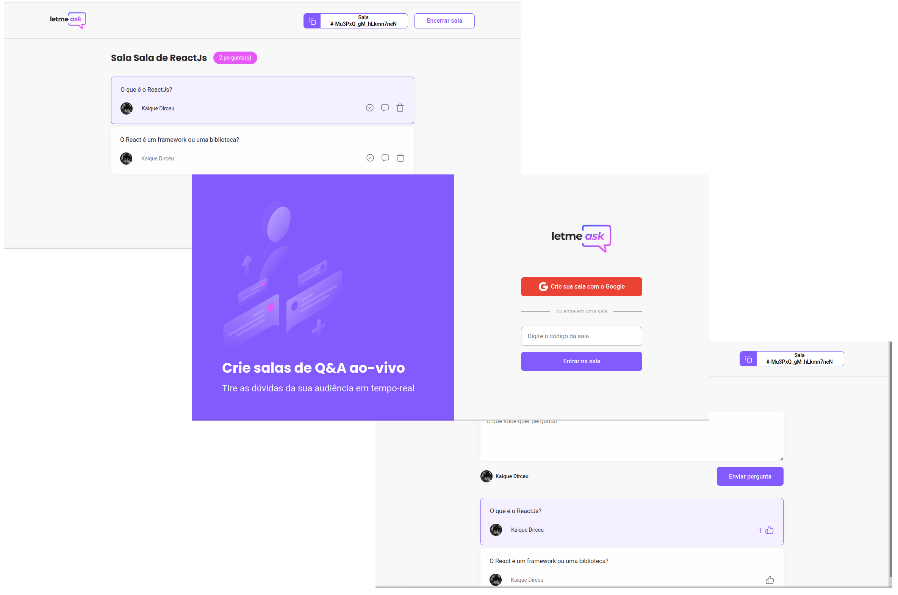

<div align="center">
  
</div>

<p align="center">
  

  
</p>

<p align="center">
  
</p>

<h4 align="center"> 
	🚧  Letmeask | Concluído 🚀 🚧
</h4>


## 🛠 Tecnologias 

Esse projeto foi desenvolvido com as seguintes tecnologias:

<a align="center" href="https://reactjs.org/">
  
</a>

<a align="center" href="https://www.typescriptlang.org/">
  
</a>

<a align="center" href="https://firebase.google.com/">
  
</a>

## 💻 Sobre o projeto

Letmeask é perfeito para criadores de conteúdos poderem criar salas de Q&A com o seu público, de uma forma muito organizada e democrática.

## 🌀 Como executar o programa
Clone o projeto e acesse a pasta do mesmo.

```bash
$ git clone https://github.com/rocketseat-education/nlw-06-reactjs
$ cd leatmeask
```

Para iniciá-lo, siga os passos abaixo:
```bash
# Instalar as dependências
$ yarn

# Iniciar o projeto
$ yarn start
```
O app estará disponível no seu browser pelo endereço http://localhost:3000.

Lembrando que será necessário criar uma conta no [Firebase](https://firebase.google.com/) e um projeto para disponibilizar um Realtime Database.


## 📄 Licença

Esse projeto está sob a licença MIT. Veja o arquivo [LICENSE](LICENSE) para mais detalhes.


### Autor
---
👾
<b>Kaique Dirceu 🚀</b>

Feito com ❤️ por Kaique Dirceu 👋🏽 Entre em contato!

[](https://twitter.com/Kaique_dirceu)  [](https://www.linkedin.com/in/kaique-dirceu/)   [](mailto:contatokaiquedirceu@gmail.com)
